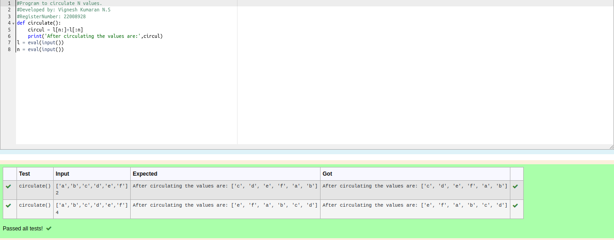

# Circulate-the-values-of-N-variables
## Aim:
To write a python program to circulate the n variables using function concept
## Equipment’s required:
PC
Anaconda - Python 3.7
## Algorithm: 
<<<<<<< HEAD
### Step 1: 
=======
### Step 1:
<<<<<<< HEAD
>>>>>>> 32db2f5 (added)
import def circulate
=======
import def circulate.
>>>>>>> dfe4854 (added)
### Step 2: 
prepare the lists form linear equations
### Step 3: 
Get the value from the user for the number of rotation
### Step 4: 
Using the slicing concept rotate the list
### Step 5: 
print the value it would be circulated
### Step 6: 
end the program
## Program:
```
#Program to circulate N values.
#Developed by: Vignesh Kumaran N.S
#RegisterNumber: 22008928
def circulate():
    circul = l[n:]+l[:n]
    print('After circulating the values are:',circul)
l = eval(input())
n = eval(input())
```

<<<<<<< HEAD
## Output:

=======
## Output:[OUTPUT12!](circulate1.png)
>>>>>>> f9ca5d6 (added)

## Result:
Thus the program is exicuted
